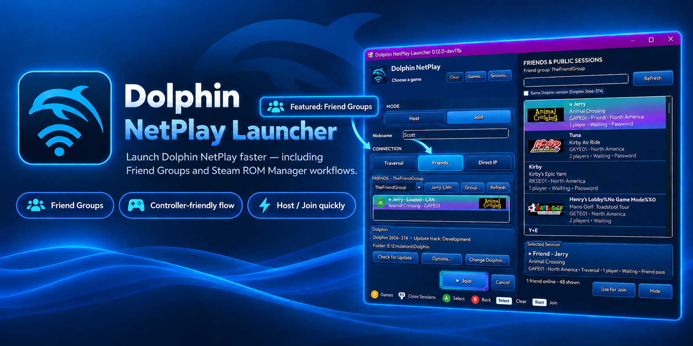
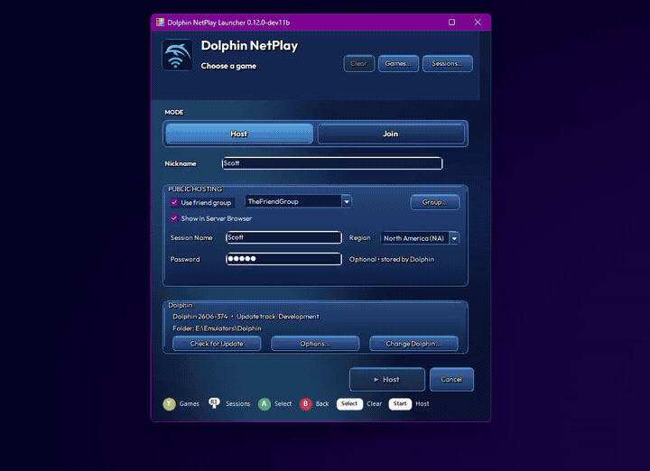
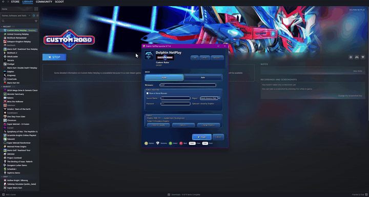
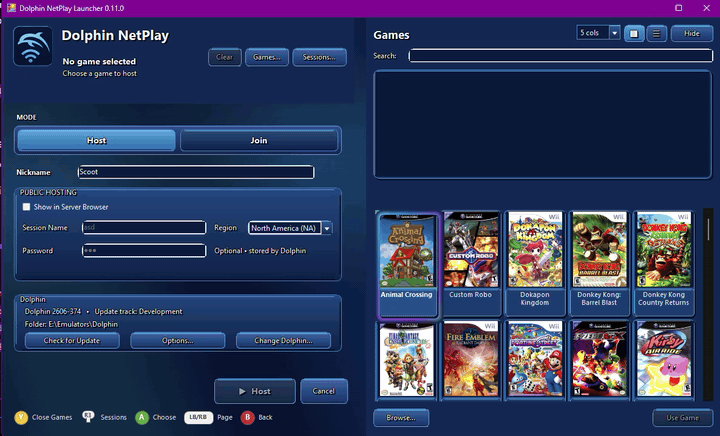
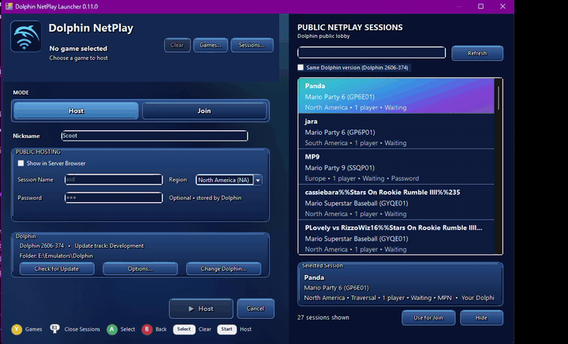

# Dolphin NetPlay Launcher

Dolphin NetPlay Launcher is a Windows frontend for **Dolphin NetPlay**. It simplifies Host and Join setup while leaving Dolphin itself in charge of emulation, networking, compatibility, and updates.

> **Unofficial project:** not affiliated with or endorsed by the Dolphin Emulator project. Dolphin NetPlay Launcher does not include Dolphin or game files.
>
> **AI-assisted development:** Dolphin NetPlay Launcher was developed with OpenAI's ChatGPT generating the application's code from my requirements, feedback, testing, and design decisions.

<p align="center">
  
</p>

## What it does

- Adds **Friend Groups** so configured friends can be found in Dolphin's public NetPlay lobby without exchanging room codes every time ([setup and `.dnlgroup` sharing guide](Documentation/FRIEND-GROUPS-AND-DNLGROUP.md)).
- Makes **Host** and **Join** setup controller-friendly.
- Supports Dolphin **Traversal room codes** and **Direct IP** connections, including optional same-network/LAN routing for friends on the same home network.
- Includes a searchable **Games** library and **Public Sessions** browser.
- Works standalone or through **Steam ROM Manager** (see the included [PDF setup guide](Documentation/Dolphin-NetPlay-Launcher-SRM-Setup-Guide-v6.pdf)).
- Uses Dolphin's own NetPlay and updater rather than replacing them.

## Why make this?

I made Dolphin NetPlay Launcher because I wanted an easier way to play Dolphin NetPlay with friends who do not use it often enough to remember all of the setup. Instead of walking everyone through the same Dolphin menus and connection steps each time, the launcher handles the repetitive parts for us.

It also solves a specific problem with using **Steam as a frontend for Dolphin games through Steam ROM Manager**. Launching an individual Dolphin game from Steam normally starts that game directly; Dolphin NetPlay Launcher lets that selected game pass through the launcher first so you can choose **Host** or **Join** instead.

With **Friend Groups**, repeat sessions can skip room-code exchanges entirely, and the normal Host/Join flow can be handled with a controller. Dolphin still owns NetPlay itself — the launcher is only there to make **getting into Dolphin NetPlay** more convenient.

## How does it work?

Dolphin NetPlay Launcher does **not** implement NetPlay itself. Dolphin still handles the connection, emulation, synchronization, game launch, and NetPlay session. The launcher automates the setup needed to reach Dolphin's existing NetPlay lobby.

<details>
<summary><strong>Details: Host / Join automation steps</strong></summary>

<table>
<tr><td>
<strong>When you choose Host or Join, Dolphin NetPlay Launcher:</strong>
<ol>
<li>Identifies the selected game with Dolphin's own <code>DolphinTool.exe</code> when a local game needs to be staged for hosting.</li>
<li>Writes the required NetPlay settings to Dolphin's configuration, such as nickname and Traversal or Direct-IP connection information.</li>
<li>Starts Dolphin normally.</li>
<li>Waits for Dolphin's main window, then opens <strong>Tools → Start NetPlay</strong>.</li>
<li>Detects Dolphin's <strong>NetPlay Setup</strong> window and performs the appropriate <strong>Host</strong> or <strong>Connect</strong> action.</li>
<li>Waits for Dolphin's real <strong>NetPlay</strong> lobby. At that point Dolphin has taken over and the setup automation is finished.</li>
<li>Optionally provides controller shortcuts for a small set of useful lobby actions and handles the normal return-to-launcher lifecycle afterward.</li>
</ol>
</td></tr>
</table>

</details>

<details>
<summary><strong>Why does it automate Dolphin's UI?</strong></summary>

<table>
<tr><td>
<p>This part is admittedly a little unconventional. Dolphin supports command-line options for things such as launching games and changing configuration values, but it does not currently expose a supported command-line action for opening NetPlay directly into a <strong>Host</strong> or <strong>Join</strong> session. The current command-line surface can be seen in Dolphin's <a href="https://github.com/dolphin-emu/dolphin/blob/master/Source/Core/UICommon/CommandLineParse.cpp">command-line parser</a>.</p>
<p>Because of that, Dolphin NetPlay Launcher combines Dolphin's normal configuration files with narrowly scoped Windows UI automation for the final setup steps. In practical terms, it performs the same Dolphin menu/button actions a person would otherwise perform manually. The automation is limited to the Dolphin process launched for that session, checks for the expected Dolphin windows before acting, and stops driving setup once the actual NetPlay lobby appears.</p>
<p>It is not the most elegant integration in the world, but without a NetPlay command-line/API entry point in Dolphin there is not currently a cleaner supported route to the same seamless workflow. <strong>Regardless, it works.</strong></p>
</td></tr>
</table>

</details>

## Showcase

<details open>
<summary><strong>Join a Friend Group session</strong></summary>

Set up a Friend Group once, then see when a friend is hosting and join them without exchanging room codes or manually setting up Dolphin NetPlay. For setup, importing/exporting, identities, and LAN overrides, see the [Friend Groups guide](Documentation/FRIEND-GROUPS-AND-DNLGROUP.md).

<p align="center">
  <a href="Documentation/Media/dolphin-netplay-friend-groups-demo.mp4">
    
  </a>
</p>

</details>

<details>
<summary><strong>Host a game from Steam</strong></summary>

Launch a game from your Steam library, choose **Host**, and Dolphin NetPlay Launcher handles opening Dolphin and setting up the NetPlay lobby.

<p align="center">
  <a href="Documentation/Media/dolphin-netplay-steam-host-demo.mp4">
    
  </a>
</p>

</details>

<details>
<summary><strong>Browse your game library</strong></summary>

Browse the Dolphin-configured library from the launcher. Grid and List views are both available.

<p align="center">
  <a href="Documentation/Media/dolphin-netplay-library-grid.mp4">
    
  </a>
</p>

</details>

<details>
<summary><strong>Browse public NetPlay sessions</strong></summary>

Browse Dolphin's public NetPlay sessions, inspect the advertised game/session details, and feed a compatible session into the normal Join workflow.

<p align="center">
  <a href="Documentation/Media/dolphin-netplay-sessions-browser.mp4">
    
  </a>
</p>

</details>

## Quick Install

You need Windows, a current Dolphin installation containing `Dolphin.exe` and `DolphinTool.exe`, and your own game files for games you want to host.

1. Extract the entire Dolphin NetPlay Launcher folder. Do not move only the EXE.
2. Recommended: place the launcher folder inside your Dolphin folder:

```text
Dolphin\
├─ Dolphin.exe
├─ DolphinTool.exe
└─ DolphinNetPlayLauncher\
   └─ DolphinNetPlayLauncher.exe
```

3. Run `DolphinNetPlayLauncher.exe`.
4. Confirm the Dolphin installation it finds, or choose another `Dolphin.exe`.
5. If Dolphin has never been run, let the launcher open it once. Finish Dolphin's first-run setup, add your game folders, then close Dolphin.

The launcher reads the game folders already configured in Dolphin.

## During automatic Dolphin setup

While **Setting up Dolphin NetPlay...** is visible, avoid clicking, typing, moving the mouse, or using the controller. The launcher is briefly controlling Dolphin's NetPlay setup window. Dolphin takes over normally once the lobby opens.

## Controller Navigation

Controller navigation uses SDL3, with on-screen prompts for Xbox, PlayStation, or Switch-style labels. Controller options are under **Options → Controller**.

<details>
<summary><strong>Controller button map</strong></summary>

| Input | Action |
| --- | --- |
| **D-pad / Left Stick** | Navigate |
| **South face button** | Select |
| **East face button** | Back |
| **LB / RB** | Page through Games where applicable |
| **Start / Options / +** | Main Host/Join action |
| **Select / Create / -** | Clear Game |
| Configurable face-button shortcut | Games or Paste |
| **R3** | Sessions |

</details>

## Steam ROM Manager

Dolphin NetPlay Launcher supports **Steam ROM Manager** so you can create a separate Dolphin NetPlay collection in Steam and launch selected games directly into the launcher.

For setup, use the included illustrated guide:

**`Documentation/Dolphin-NetPlay-Launcher-SRM-Setup-Guide-v6.pdf`**

A shorter text reference is also included as **`SRM-INSTRUCTIONS.txt`**.

## Troubleshooting

<details>
<summary><strong>My controller isn't working in-game!</strong></summary>

<table>
<tr><td>
<p>Dolphin can see controllers differently depending on how it was launched. In particular, a controller exposed to Dolphin when it is started through Steam may differ from the controller Dolphin sees when it is launched directly.</p>
<p>This behavior comes from <strong>Dolphin/Steam's controller handling, not Dolphin NetPlay Launcher</strong>.</p>
<p>If your controls work when launching Dolphin one way but not another, open Dolphin using the same method you normally use for your games and configure the controller there. If you normally launch your Dolphin games through Steam, configure Dolphin's controls while using that same Steam launch path.</p>
</td></tr>
</table>
</details>

<details>
<summary><strong>A friend is missing from Friends</strong></summary>

<table>
<tr><td>
<p>Make sure the correct Friend Group is active and that the public session name exactly matches the member name saved in that group.</p>
</td></tr>
</table>
</details>

<details>
<summary><strong>An imported `.dnlgroup` does not show the right people</strong></summary>

<table>
<tr><td>
<p>Re-import it and choose the correct local identity. Your own identity is intentionally excluded from the Join roster.</p>
</td></tr>
</table>
</details>

<details>
<summary><strong>Dragging a `.dnlgroup` onto the launcher does nothing while running as Administrator</strong></summary>

<table>
<tr><td>
<p>Windows may block drag/drop from a normal Explorer process into an elevated application. Use <strong>Options → Friends → Import <code>.dnlgroup</code>...</strong> instead.</p>
</td></tr>
</table>
</details>

<details>
<summary><strong>A household/LAN friend is discovered but cannot connect through the normal route</strong></summary>

<table>
<tr><td>
<p>Configure that Friend under <strong>Options → Friends → Same-network / LAN connection</strong> on the joining PC. Same-network connection overrides are stored locally on that PC and are not carried inside <code>.dnlgroup</code> files.</p>
</td></tr>
</table>
</details>

<details>
<summary><strong>Dolphin was not found</strong></summary>

<table>
<tr><td>
<p>Choose another <code>Dolphin.exe</code>, or use <strong>Options → Change Dolphin</strong>.</p>
</td></tr>
</table>
</details>

<details>
<summary><strong>Dolphin configuration is missing</strong></summary>

<table>
<tr><td>
<p>Let Dolphin run once, complete its setup, then close it and return to Dolphin NetPlay Launcher.</p>
</td></tr>
</table>
</details>

<details>
<summary><strong>Games is empty</strong></summary>

<table>
<tr><td>
<p>Make sure your game folders already appear in Dolphin's own game list. Dolphin NetPlay Launcher reads the game folders configured in Dolphin rather than maintaining a separate ROM-directory setup.</p>
</td></tr>
</table>
</details>

<details>
<summary><strong>Dolphin NetPlay Launcher is using the wrong Dolphin library/settings</strong></summary>

<table>
<tr><td>
<p>Verify which Dolphin installation and user-data folder you are using. Portable and installed Dolphin configurations can use different user-data locations.</p>
</td></tr>
</table>
</details>

<details>
<summary><strong>NetPlay automation cannot control Dolphin</strong></summary>

<table>
<tr><td>
<p>Avoid running Dolphin elevated unless Dolphin NetPlay Launcher is elevated too. Windows blocks some cross-privilege UI automation between applications running at different integrity levels.</p>
</td></tr>
</table>
</details>

<details>
<summary><strong>Dolphin stays open after NetPlay</strong></summary>

<table>
<tr><td>
<p>Check <strong>Automatically close Dolphin when NetPlay lobby closes</strong> and its grace-period setting under Options.</p>
</td></tr>
</table>
</details>

## Known Issues

<details>
<summary><strong>Controller input can occasionally stop responding in Dolphin's NetPlay lobby when launched through Steam</strong></summary>

<table>
<tr><td>
<p>This has been observed intermittently, most often while <strong>Joining</strong>. The NetPlay connection itself can continue to work normally even when lobby-controller input is unavailable.</p>
<p>If this happens, use the mouse or keyboard to interact with or close Dolphin's NetPlay lobby. Controller input normally becomes available to Dolphin NetPlay Launcher again after Dolphin closes. In some Steam/Steam Input return cases, recovery can take roughly <strong>5–6 seconds</strong>.</p>
<p>The launcher intentionally does not use aggressive controller reacquisition during gameplay because prior experiments could interfere with otherwise working Host/lobby controller behavior.</p>
</td></tr>
</table>
</details>

<details>
<summary><strong>Failed-Join result dialogs may also ignore controller input</strong></summary>

<table>
<tr><td>
<p>When a Join attempt fails, Dolphin may show connection-result dialogs while controller input is temporarily unavailable. Dolphin NetPlay Launcher validates the exact Dolphin result dialog and, if no usable controller acknowledgement arrives for 4 seconds, automatically confirms that dialog so recovery can continue.</p>
</td></tr>
</table>
</details>

## Full documentation

For detailed Friend Group setup and `.dnlgroup` sharing, see **[Friend Groups and `.dnlgroup` Files](Documentation/FRIEND-GROUPS-AND-DNLGROUP.md)**. For Host/Join behavior, portable Dolphin, controller polling, Dolphin updates, diagnostics, and build information, see the included documentation files and **`README.txt`**.
