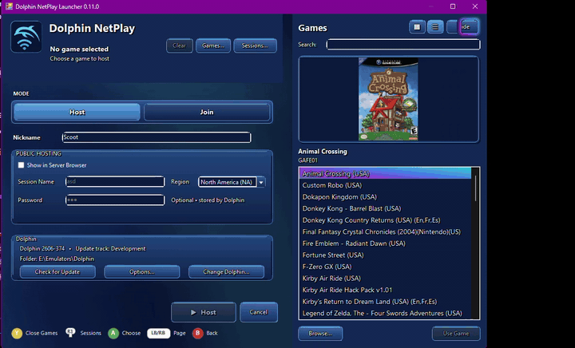

# Dolphin NetPlay Launcher

> **Current release:** 0.11.0 — released September 18, 2026.

Dolphin NetPlay Launcher is a Windows frontend for **Dolphin NetPlay**. It simplifies Host and Join setup while leaving Dolphin itself in charge of emulation, networking, compatibility, and updates.

> **Unofficial project:** not affiliated with or endorsed by the Dolphin Emulator project. Dolphin NetPlay Launcher does not include Dolphin or game files.

> **AI-assisted development:** Dolphin NetPlay Launcher was developed with OpenAI's ChatGPT generating the application's code from my requirements, feedback, testing, and design decisions.

## What it does

- Makes **Host** and **Join** setup controller-friendly.
- Supports Dolphin **Traversal room codes** and **Direct IP** connections.
- Includes a searchable **Games** library using the folders already configured in Dolphin.
- Includes a **Sessions** browser for compatible public Dolphin NetPlay sessions.
- Can create public sessions using Dolphin's own server-browser settings.
- Works standalone or through **Steam ROM Manager**.
- Uses Dolphin's own updater instead of replacing Dolphin itself.

## Why make this?

I made Dolphin NetPlay Launcher because I wanted an easier way to play Dolphin NetPlay with friends who do not use it often enough to remember all of the setup. Instead of walking everyone through the same Dolphin menus and connection steps again each time we play, I wanted a controller-friendly front end that could handle the repetitive parts for us.

It is not meant to replace Dolphin or its NetPlay implementation. The goal is simply to make getting everyone into a Dolphin NetPlay session feel more like starting a normal multiplayer game.

## Showcase

Dolphin NetPlay Launcher brings the most common Dolphin NetPlay tasks into a controller-friendly interface designed to work naturally from Steam. Browse your games, find public sessions, and launch into Dolphin without navigating through Dolphin's menus each time.

### Host a game from Steam

Launch a game from your Steam library, choose **Host**, and Dolphin NetPlay Launcher handles opening Dolphin and setting up the NetPlay lobby.

<p align="center">
  <a href="Documentation/Media/dolphin-netplay-steam-host-demo.mp4">
    
  </a>
</p>

### Browse your game library

Use the built-in Games browser to select GameCube and Wii titles without leaving the launcher. Grid view emphasizes cover art and makes controller navigation feel like a console library.

<p align="center">
  <a href="Documentation/Media/dolphin-netplay-library-grid.mp4">
    
  </a>
</p>

### Switch to list view

For larger collections, switch to the compact list view to browse titles alongside game information and artwork.

<p align="center">
  <a href="Documentation/Media/dolphin-netplay-library-list.mp4">
    
  </a>
</p>

### Browse public NetPlay sessions

Open the Sessions browser to view public Dolphin NetPlay rooms, inspect session details, and select a room to use for Join.

<p align="center">
  <a href="Documentation/Media/dolphin-netplay-sessions-browser.mp4">
    
  </a>
</p>

## Quick Install

You need Windows, a current Dolphin installation containing `Dolphin.exe` and `DolphinTool.exe`, and your own game files for games you want to host.

1. Extract the entire Dolphin NetPlay Launcher folder. Do not move only the EXE.
2. Recommended: place the launcher folder inside your Dolphin folder:

```text
Dolphin\
├─ Dolphin.exe
├─ DolphinTool.exe
└─ DolphinNetPlayLauncher\
   └─ DolphinNetPlayLauncher.exe
```

3. Run `DolphinNetPlayLauncher.exe`.
4. Confirm the Dolphin installation it finds, or choose another `Dolphin.exe`.
5. If Dolphin has never been run, let the launcher open it once. Finish Dolphin's first-run setup, add your game folders, then close Dolphin.

The launcher reads the game folders already configured in Dolphin.

On a fresh launcher configuration, **Nickname** starts as `Player`, while Traversal/Direct-IP targets and public-host session name/password fields start blank. Dolphin NetPlay Launcher does not import those saved values from an existing Dolphin profile. Values you enter for nickname and Join targets can be remembered by the launcher for later use.

### Portable Dolphin

If you intentionally use Dolphin in portable mode, `portable.txt` belongs beside `Dolphin.exe`. Otherwise Dolphin may use its normal Windows user-data folder.

## Host

1. Open **Games** and choose the game you want to host.
2. Select **Host** and enter your nickname.
3. Optional: enable **Show in Server Browser** and enter the public-session details you want.
4. Choose **Host**.

Hosting uses Dolphin's Traversal Server. Dolphin NetPlay Launcher opens Dolphin's NetPlay interface, selects the game, and creates the lobby.

## Join

You **do not need to select a local game before joining**. The host determines the game used by the session.

You can join with:

- **Sessions** — choose a compatible public session, then use it for Join.
- **Traversal** — enter or paste the host's room code.
- **Direct IP** — enter the host's IP address and port.

Then choose **Join**. Dolphin NetPlay Launcher opens Dolphin's NetPlay interface and connects.

## During automatic Dolphin setup

While **Setting up Dolphin NetPlay...** is visible, avoid clicking, typing, moving the mouse, or using the controller. The launcher is briefly controlling Dolphin's NetPlay setup window. Dolphin takes over normally once the lobby opens.

## Games Library

**Games** reads the GameCube/Wii folders configured in Dolphin and supports:

- search;
- grid and list views;
- cover artwork with Dolphin banner fallback;
- basic game metadata;
- controller navigation and paging.

If Games is empty, open Dolphin, make sure the game folders appear in Dolphin's own game list, close Dolphin, and try again. The first Games open in a launcher session may take longer while the library is loaded; later openings are much faster.

## Public Sessions

**Sessions** shows compatible public Dolphin NetPlay sessions. By default, the launcher filters for sessions using the same Dolphin version.

Selecting a session prepares its connection information for **Join**. It does not launch a local game.

When hosting, **Show in Server Browser** uses Dolphin's public-index settings. You can set a session name, region, and optional password.

## Controller Navigation

Controller navigation uses SDL3. On-screen prompts can use Xbox, PlayStation, or Switch-style labels.

Common controls:

- **D-pad / Left Stick** — navigate
- **South face button** — select
- **East face button** — back
- **LB / RB** — page through Games where applicable
- **Start / Options / +** — main Host/Join action
- **Select / Create / -** — Clear Game
- Configurable face-button shortcut — Games or Paste
- **R3** — Sessions

Controller options are under **Options → Controller**.

### Controller Input Polling

Launcher input polling can be set to:

- **60 Hz (baseline)**
- **120 Hz**
- **Match monitor (max 240 Hz)**

**Match monitor** is the recommended default when it feels good on your system. This setting affects launcher input detection only while Dolphin NetPlay Launcher has focus. It does **not** increase polling during Dolphin gameplay, and it does not change the animated-background refresh rate.

When Dolphin's tracked NetPlay lobby is in the foreground, the launcher can provide limited controller shortcuts for lobby controls. It does not send launcher navigation input into gameplay or unrelated applications.

## Steam ROM Manager

Steam ROM Manager can create a separate **Dolphin Netplay** Steam collection whose entries pass a selected ROM to Dolphin NetPlay Launcher.

For the illustrated walkthrough, open:

**`Documentation/Dolphin-NetPlay-Launcher-SRM-Setup-Guide-v6.pdf`**

Quick setup:

1. Clone your working Dolphin parser.
2. Point it at the parent folder containing your GameCube/Wii folders.
3. Set the executable to `DolphinNetPlayLauncher.exe`.
4. Set arguments to exactly `"${filePath}"` — **do not use Dolphin's normal `-e` argument**.
5. Use a separate Steam collection such as `Dolphin Netplay`.
6. Append ` Netplay` to `${fuzzyTitle}` if you want the shortcuts to be easy to distinguish.
7. Parse, exclude games you do not want in the NetPlay collection, and save the app list to Steam.

`SRM-INSTRUCTIONS.txt` contains the same setup as a short text reference.

## Dolphin Updates

**Check for Dolphin Update** invokes Dolphin's own updater. Dolphin NetPlay Launcher does not download replacement Dolphin builds itself.

The launcher waits for Dolphin's update flow and requests normal, graceful closes when appropriate. It does not force-kill Dolphin.

## Settings and Diagnostics

Options include Dolphin selection, automatic close behavior, close grace periods, appearance/themes, interface sounds, controller settings, Games preferences, and diagnostics.

Fresh installs use **Adventure Blue**, the **Outfit** interface font, **Animated Gradient** accents, an animated theme background, and **Classic UI (Lokif CC0)** interface sounds as the default presentation. Existing saved preferences are preserved. **Reset Options** restores these defaults.

Settings are stored in `config.ini` beside the launcher.

For diagnostic information, use **Options → Diagnostics → Copy Diagnostic Info**. The launcher also keeps `DolphinNetPlayLauncher-Diagnostics.log` beside the launcher. Traversal room codes and Direct IP targets are not written to the diagnostic log, and Windows profile paths are redacted where appropriate.

## Troubleshooting

### Dolphin was not found

Choose another `Dolphin.exe`, or use **Options → Change Dolphin**. The selected installation must contain both `Dolphin.exe` and `DolphinTool.exe`.

### Dolphin configuration is missing

Let the launcher open Dolphin once, complete Dolphin's setup, then close Dolphin. Dolphin creates its own configuration; the launcher does not fabricate one.

### Games is empty

Make sure your game folders appear in Dolphin's own game list. Dolphin NetPlay Launcher reads those same configured folders.

### The wrong Dolphin library/settings appeared

Check which Dolphin user-data folder that installation is using. If you intentionally use portable Dolphin, place `portable.txt` beside `Dolphin.exe`.

### NetPlay automation cannot control Dolphin

Windows can block a normal application from automating an elevated application. If Dolphin is running as administrator while the launcher is not, the launcher should detect the mismatch and offer to restart itself elevated.

### Dolphin stays open after NetPlay

Check **Automatically close Dolphin when NetPlay lobby closes** and its grace-period setting. The launcher requests a normal close rather than killing Dolphin.

## Known Issues

### Controller input can occasionally stop responding in Dolphin's NetPlay lobby when launched through Steam

This has been observed intermittently, most often while **Joining**. The NetPlay connection itself can continue to work normally even when lobby-controller input is unavailable.

If this happens, use the mouse or keyboard to interact with or close Dolphin's NetPlay lobby. Controller input normally becomes available to Dolphin NetPlay Launcher again after Dolphin closes. In some Steam/Steam Input return cases, recovery can take roughly **5–6 seconds**.

The launcher intentionally does not use aggressive controller reacquisition during gameplay because prior experiments could interfere with otherwise working Host/lobby controller behavior.

### Failed-Join result dialogs may also ignore controller input

When a Join attempt fails, Dolphin may show connection-result dialogs while controller input is temporarily unavailable. Dolphin NetPlay Launcher validates the exact Dolphin result dialog and, if no usable controller acknowledgement arrives for 4 seconds, automatically confirms that dialog so recovery can continue. This fallback is limited to validated failed-Join result dialogs.

## NetPlay Compatibility

Dolphin's normal NetPlay compatibility rules still apply. Players should use compatible Dolphin builds and matching game data as required by Dolphin.

## Build from Source

The development package includes `DolphinNetPlayLauncher.cs` and `Build.bat`. On Windows, run `Build.bat`; it builds the launcher and obtains the required SDL3 runtime when needed. `Package-Release.bat` creates the clean end-user ZIP after a successful build.

